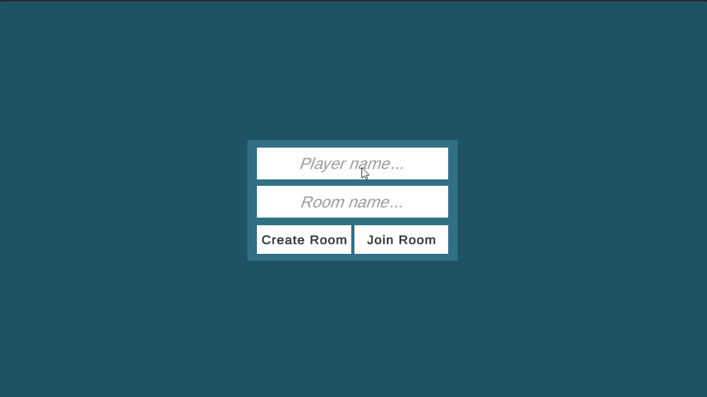

# Steal Hat - Unity 3D Photon Multiplayer Prototype

3D Multiplayer prototype using Photon Unity Networking 2 (PUN 2) and Unity 2022 LTS.

## Description

Steal the hat from other players and run away, the player with most hat time wins.

## Features

- 3D Top-down isometric view multiplayer game.
- Player movement and jumping.
- Lobby system.
- Room creation and joining.
- Networked player movement.
- Networked player hat stealing.
- Networked player hat synchronization.
- Networked player hat winning condition.

## Controls

- `WASD` or `Arrow keys` to move.
- `Space` to jump.

## Setup

This assumes you have a Photon account and have created a new application in the Photon Dashboard.

1. Clone the repository.
2. Open the `Assets/Photon/PhotonUnityNetworking/Resources` directory.
2. Copy the `PhotonServerSettings.asset.example` and remove the `.example` extension.
3. Open the project with Unity.
4. Setup the project and copy your `AppIdRealtime` to the `PhotonServerSettings` file.
5. Build and run the project.